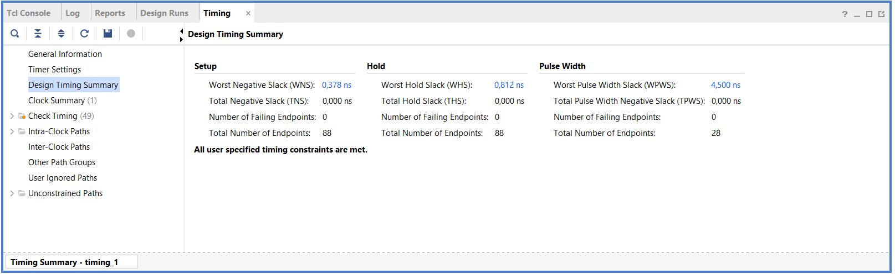
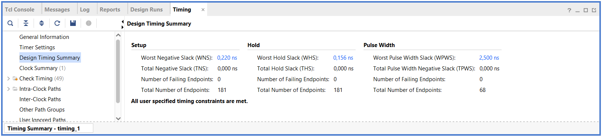
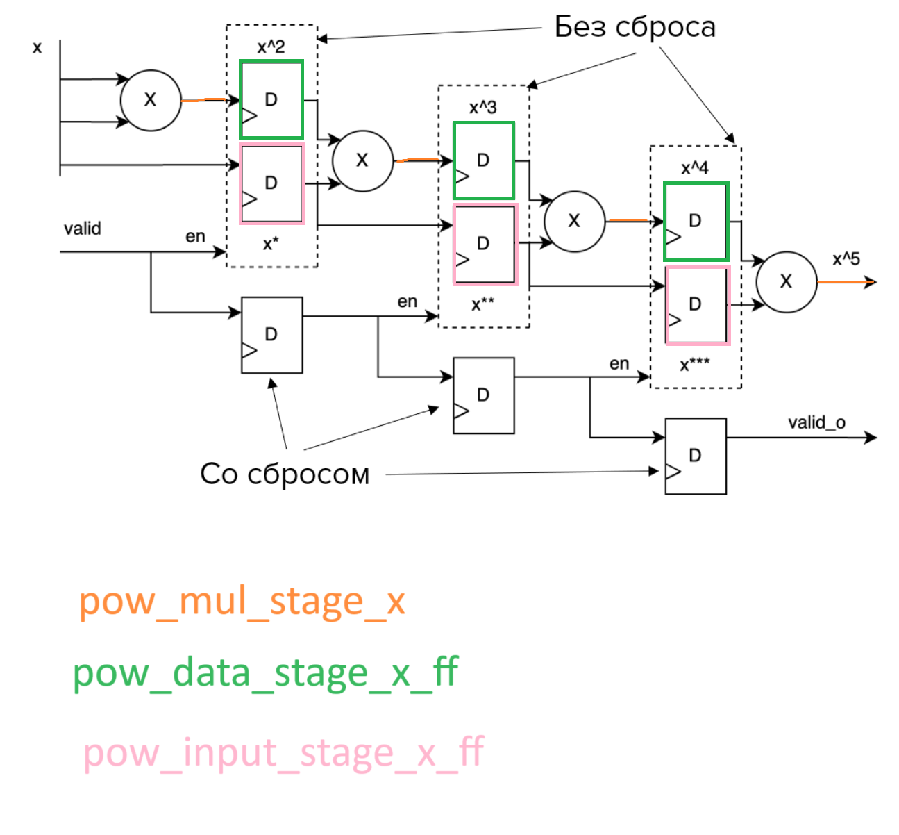

# Lab 05. Pipelines and Systolic arrays

## Сделайте сравнительный анализ тактовой частоты примера без конвейеризации и примера с конвейеризацией. Какой из примеров быстрее, почему?
Временной анализ для комбинационной логики возведения в 5-ую степень:

Путём подбора периода тактового сигнала удалось установить его минимальное значения (с точностью до 1 нс) с условием `WNS > 0`. Период равен 22 нс. Зная время периода T_c и WNS можем рассчитать максимальную частоту для этой схемы по следующей формуле: `𝐅_𝐦𝐚𝐱 = 𝟏 / (𝐓_𝐜 - WNS)`
Итого `F_max = 1 / ((22 - 0.378) * 10^-9) ≈ 46.2492 MHz`

Аналогично для конвейерного возведения в степень:

`T_c = 8 ns`, `WNS = 0.220 ns`, `F_max ≈ 128.5350 MHz`

>Очевидно, конвейерная реализация позовляет работать на больших частотах, чем простая комбинационная схема. Связана такая разница максимальных частот в отличном критическом пути каждой схемы (у комбинационной схемы он больше).

## Добавьте clock gating для регистров с данными в пример исходного кода по ссылке. Напишите тестбенч и убедитесь в том, что дизайн работает корректно после правок.

## Уберите лишние ресеты в примере исходного кода по ссылке. Напишите тестбенч и убедитесь в том, что дизайн работает корректно после правок.

## Откройте файл по ссылке. В этом файле находится пример систолического массива размером 2x2. Увеличьте размер массива до 2x3 (2 в высоту, 3 в ширину, как в рассмотренных примерах), добавив ещё два узла. Напишите тестбенч и убедитесь в том, что дизайн работает корректно после правок.

## Доп. Вопросы
* Что такое критический путь?
* Что такое конвейер в цифровой технике?
* Что такое латентность конвейера?
* Из чего складывается энергопотребление цифровой микросхемы? Опишите составляющие.
* Что такое Clock gating? Какие виды Clock gating вы знаете?
* Что такое free running регистры?
* Зачем может быть полезен флаг валидности данных в конвейере?
* Чем синхронный сброс отличается от асинхронного?
* Почему в ASIC лучше использовать регистры без асинхронного сброса там, где это возможно?
* Что такое систолический массив? Зачем он может применяться?
* Что такое узел систолического массива? Как он работает?
* Как происходит распространение данных и результатов вычислений в систолическом массиве?

## Аббривеатуры
* WNS = Worst Negative Slack
* TNS = Total Negative Slack = sum of the negative slack paths
* WHS = Worst Hold Slack
* THS = Total Hold Slack = sum of the negative hold slack paths
> These values inform you how much the design is missing the timing requirements. 